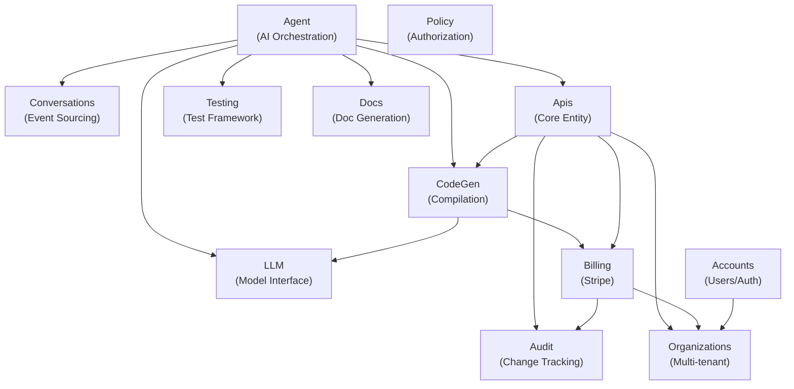

# Architecture Reference

## Context Dependency Diagram



## Data Flow 1: Agent Generation

```
User types description in ChatPanel LiveView
  │
  ├─ handle_event("send_message", ...) in ApiLive.Edit
  │    └─ Apis.start_agent_generation(api, description, user_id)
  │         └─ Oban.insert(KickoffWorker.new(%{api_id, description, user_id}))
  │
  ├─ KickoffWorker.perform/1
  │    ├─ Conversations.get_or_create_conversation(api_id, org_id)
  │    ├─ Conversations.create_run(%{conversation_id, type: "generation", ...})
  │    ├─ Conversations.append_event(%{run_id, type: "user_message", content: description})
  │    └─ Agent.Session.start(%{run_id, api_id, ...})
  │
  ├─ Session GenServer (or CodePipeline)
  │    ├─ Check LLM.CircuitBreaker.allow?(:anthropic)
  │    ├─ Build LangChain.LLMChain with tools + callbacks
  │    ├─ Task.async_nolink(fn -> LLMChain.run(chain) end)
  │    │
  │    ├─ [Loop] LLM calls tool → callback persists Event → PubSub broadcast
  │    │    ├─ compile_code → CodeGen.Compiler.compile/2
  │    │    ├─ format_code → CodeGen.Linter.auto_format/1
  │    │    ├─ lint_code → CodeGen.Linter.run_all/1
  │    │    ├─ generate_tests → Testing.TestGenerator.generate_tests/2
  │    │    ├─ run_tests → Testing.TestRunner.run/2
  │    │    └─ submit_code → saves final code, creates ApiVersion
  │    │
  │    ├─ Guardrails checked after each tool (iterations, cost, time, loops)
  │    └─ On complete: Conversations.complete_run/2, PubSub broadcast
  │
  └─ LiveView receives PubSub messages
       ├─ {:event_appended, event} → update timeline
       ├─ {:run_completed, run} → show results
       └─ {:api_updated, api} → refresh editor
```

## Data Flow 2: API Invocation

```
HTTP POST /api/org-slug/api-slug/endpoint
  │
  ├─ DynamicApiRouter (Plug)
  │    ├─ Parse path: extract org_slug, api_slug, endpoint
  │    ├─ Lookup Api by slug (must be status: "published")
  │    │
  │    ├─ ApiAuth plug
  │    │    ├─ Extract key from: Authorization Bearer, X-Api-Key header, ?api_key param
  │    │    ├─ SHA-256 hash the key
  │    │    ├─ Fetch ApiKey by key_prefix (first 8 chars)
  │    │    ├─ Plug.Crypto.secure_compare(stored_hash, computed_hash)
  │    │    ├─ Check: not expired, not revoked, belongs to this API
  │    │    └─ Assign :api_key to conn
  │    │
  │    ├─ RateLimiter plug
  │    │    ├─ Check per-IP: 100/min
  │    │    ├─ Check per-key: api_key.rate_limit/min (default 60)
  │    │    ├─ Check per-API: 1000/min
  │    │    └─ 429 Too Many Requests if exceeded
  │    │
  │    ├─ Billing.Enforcement.check(:api_invocation, org)
  │    │    └─ {:error, :limit_exceeded} → 402 Payment Required
  │    │
  │    ├─ Resolve compiled module
  │    │    ├─ Try Apis.Registry (in-memory)
  │    │    └─ Fallback: compile from DB, register in Registry
  │    │
  │    ├─ Execute in sandbox
  │    │    ├─ Process.flag(:max_heap_size, 20MB)
  │    │    ├─ Call module.handle(params) with timeout
  │    │    └─ Return JSON response
  │    │
  │    ├─ Log InvocationLog (async via Task.Supervisor)
  │    └─ Record UsageEvent for billing
  │
  └─ JSON response to client
```

## Data Flow 3: Billing Lifecycle

```
User clicks "Upgrade to Pro"
  │
  ├─ BillingLive.Plans handle_event("checkout", %{"plan" => "pro"})
  │    └─ Billing.create_checkout_session(org, "pro", success_url, cancel_url)
  │         └─ StripeClient.create_checkout_session(%{...})
  │              └─ Redirect to Stripe Checkout page
  │
  ├─ Stripe completes checkout, fires webhook
  │    ├─ POST /webhooks/stripe
  │    ├─ WebhookController: verify signature via Stripe.Webhook.construct_event
  │    ├─ Check ProcessedEvent: already handled? → 200 OK, skip
  │    ├─ WebhookHandler.handle(event)
  │    │    ├─ "checkout.session.completed" → create Subscription
  │    │    ├─ "customer.subscription.updated" → update Subscription
  │    │    ├─ "customer.subscription.deleted" → cancel Subscription
  │    │    └─ "invoice.payment_failed" → mark past_due
  │    ├─ Billing.create_or_update_subscription(attrs) — upsert
  │    ├─ Mark ProcessedEvent as handled
  │    └─ Return 200 OK
  │
  ├─ Enforcement gates (real-time)
  │    ├─ Apis.create_api/1 → Enforcement.check(:create_api, org)
  │    ├─ Agent.CodePipeline → Enforcement.check(:llm_generation, org)
  │    └─ DynamicApiRouter → Enforcement.check(:api_invocation, org)
  │
  └─ Usage aggregation (async)
       ├─ UsageAggregationWorker runs daily via Oban cron
       ├─ Groups UsageEvents by org_id for previous day
       ├─ Upserts DailyUsage records (idempotent)
       └─ DailyUsage powers: dashboard charts, billing portal, analytics
```

## Supervision Tree

```
Blackboex.Application
  ├─ Blackboex.Repo (Ecto)
  ├─ {Oban, @oban_config}
  ├─ Blackboex.LLM.CircuitBreaker (per provider)
  ├─ Blackboex.Apis.Registry
  ├─ {Phoenix.PubSub, name: Blackboex.PubSub}
  └─ {Task.Supervisor, name: Blackboex.TaskSupervisor, max_children: 1000}

BlackboexWeb.Application
  ├─ BlackboexWeb.Endpoint
  ├─ BlackboexWeb.RateLimiterBackend
  ├─ BlackboexWeb.BeamMonitor
  └─ BlackboexWeb.PromEx
```

## Oban Configuration

| Worker | Queue (concurrency) | Schedule | Timeout | Max Attempts |
|--------|-------------------|----------|---------|--------------|
| KickoffWorker | generation (3) | On-demand | 7 min | 2 |
| RecoveryWorker | generation (3) | */2 * * * * | — | 1 |
| UsageAggregationWorker | billing (10) | On-demand | — | 3 |
| MetricRollupWorker | analytics (5) | 0 * * * * (hourly) | — | 3 |

## System Invariants

1. **Domain purity** — `apps/blackboex` has zero Phoenix dependencies
2. **Scope threading** — every authenticated operation receives `%Scope{user, organization, membership}`
3. **Event sourcing** — Conversations are append-only: Events never updated or deleted
4. **Billing gates** — no expensive operation (create_api, llm_generation) without Enforcement.check
5. **Advisory locks** — `pg_advisory_xact_lock` on API creation prevents duplicate slugs
6. **Circuit breaker** — LLM calls gated by CircuitBreaker.allow?/1 (5 failures in 60s → open)
7. **Sandbox isolation** — user code always runs with heap + timeout limits
8. **Audit trail** — all admin and billing operations logged via Audit.log/2 + ExAudit
9. **Idempotent webhooks** — check-process-mark order, never mark before processing
10. **Constant-time secret comparison** — `Plug.Crypto.secure_compare/2` for all secret matching
